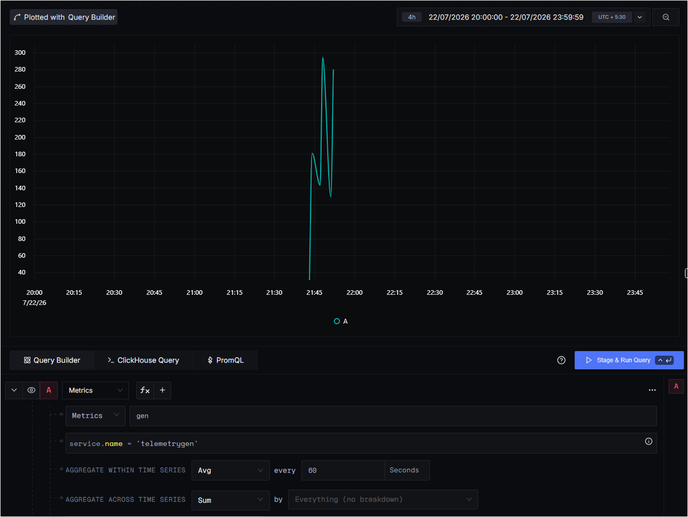
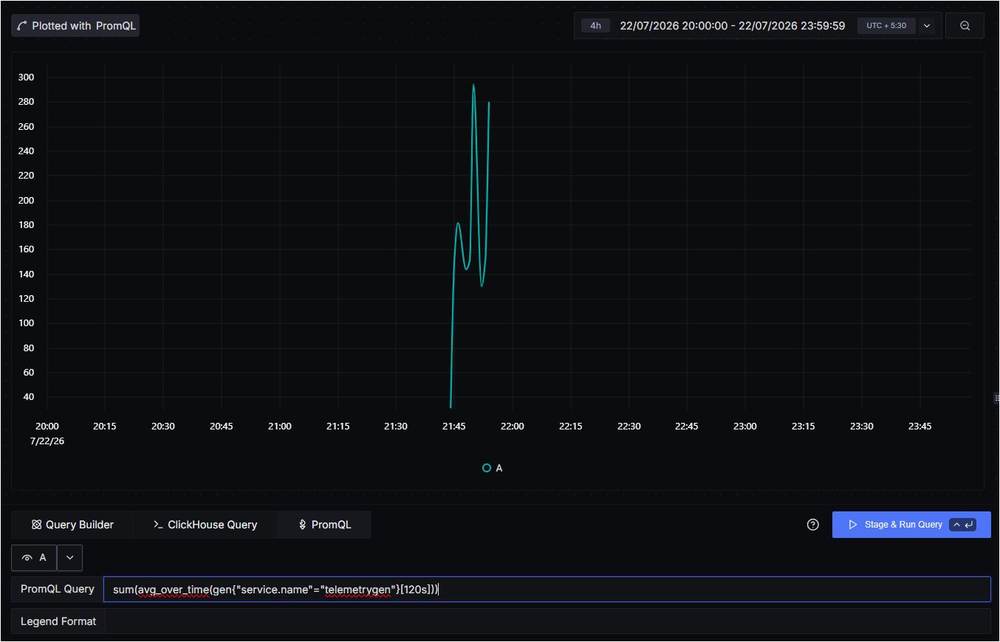
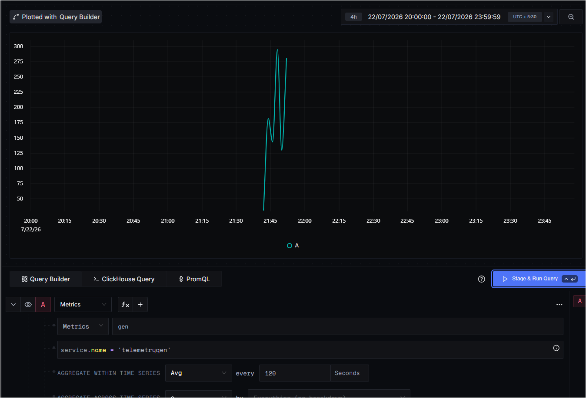
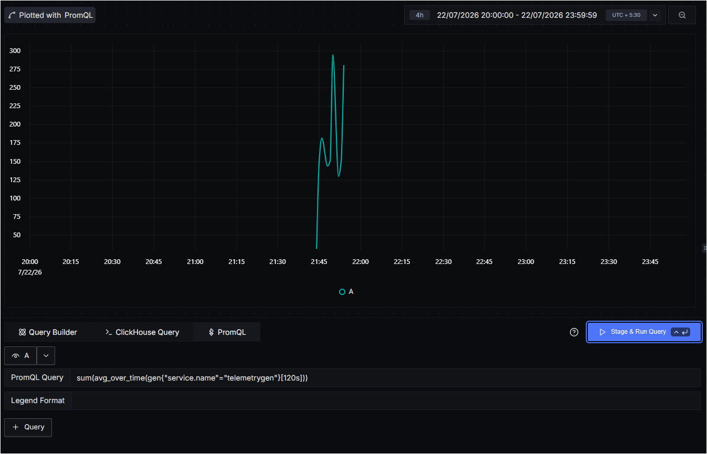
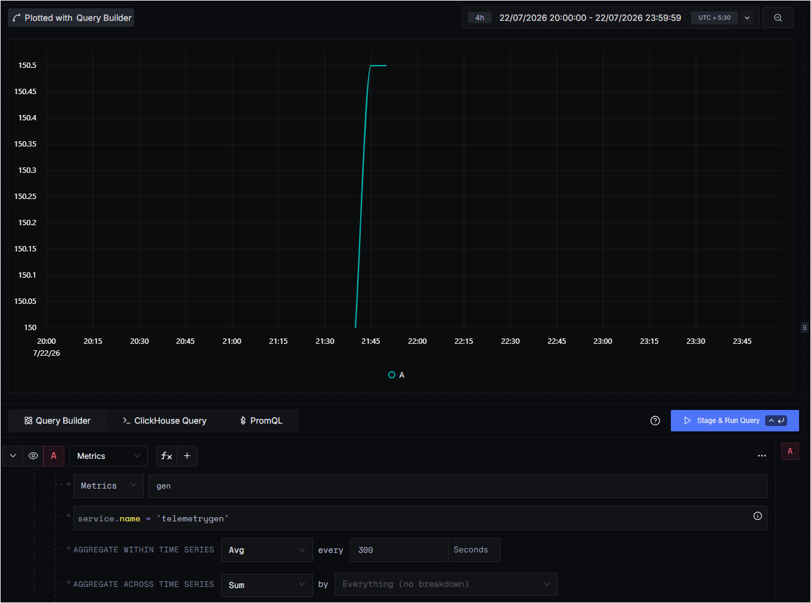
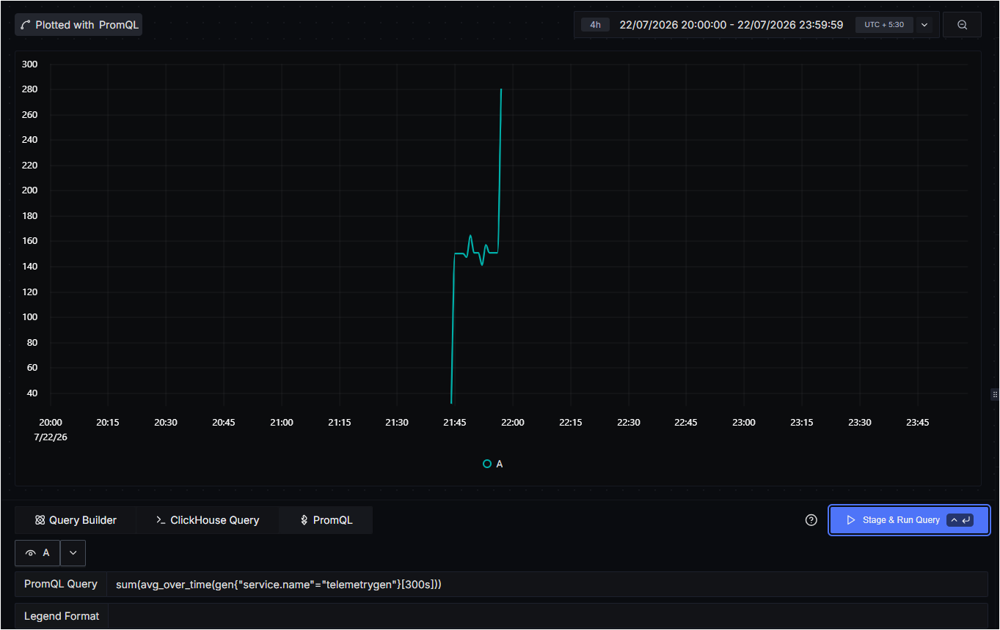

# Limitations

This document records the gaps and semantic mismatches found while building
`promql2qb`, most of them from testing generated queries against a real,
self-hosted SigNoz instance rather than just reading docs. Some of these are
things the converter doesn't support yet; one of them (time-window semantics)
isn't something the converter _can_ fix, since it's a difference in how the
two query engines evaluate a query, not a difference in JSON shape.

## 1. `avg`/`sum`/etc. time aggregation and PromQL's `_over_time` are not the

same operation once the step interval gets large

This is the most important finding in this document, and it came from
comparing the same logical query - "average the `gen` metric for
`service.name = telemetrygen`, every N seconds" - run three ways: through
SigNoz's Query Builder UI, and through the equivalent PromQL query at three
different step sizes.

### What was tested

Same metric, same filter, same fixed time range (`22/07/2026 20:00:00 -
23:59:59`) in every case, only the step size changed:

| Step | Query Builder           | PromQL                          | Result                     |
| ---- | ----------------------- | ------------------------------- | -------------------------- |
| 60s  | `avg every 60 Seconds`  | `avg_over_time(gen{...}[60s])`  | shapes match               |
| 120s | `avg every 120 Seconds` | `avg_over_time(gen{...}[120s])` | shapes match               |
| 300s | `avg every 300 Seconds` | `avg_over_time(gen{...}[300s])` | **shapes diverge sharply** |

### 60s

| Query Builder                                 | PromQL                                                            |
| --------------------------------------------- | ----------------------------------------------------------------- |
|  |  |

(The PromQL screenshot above is the 120s-range query, included here because
it was the first one that visually matched the Query Builder 60s plot -
see the note on this below.)

### 120s

| Query Builder                                   | PromQL                                                                      |
| ----------------------------------------------- | --------------------------------------------------------------------------- |
|  |  |

Still matching. Both show the same jagged rise-fall-rise pattern, same
peak/trough heights.

### 300s

| Query Builder                                                                     | PromQL                                                                                    |
| --------------------------------------------------------------------------------- | ----------------------------------------------------------------------------------------- |
|  |  |

At 300s, Query Builder's plot collapses to a single flat value around
150 - it stops showing any shape at all. PromQL's plot at the same 300s
still shows the full spiky waveform, just slightly smoothed. This is not a
small numeric discrepancy like the earlier 60s comparison (see the git
history in this repo for that first, smaller mismatch) - it's a difference
in the _number of points on the chart_, which points to a difference in
what the two systems are actually computing, not a rounding or timestamp
offset issue.

### Why this happens

**Query Builder's "aggregate within time series, every N seconds" bins the
whole query range into fixed N-second buckets** and emits one output point
per bucket. The `gen` metric's burst of activity in this test only lasted a
few minutes. At 60s and 120s buckets, that burst still spans several
buckets, so the shape survives. At 300s, the entire burst falls inside one
or two buckets, so Query Builder averages it down to essentially a single
point - hence the flat line.

**PromQL's `avg_over_time(metric[N])` is a sliding window, evaluated at
many separate instants across the range**, independent of whatever N you
put in the brackets. The window size controls how far back each instant
looks, not how many points get drawn. So PromQL keeps rendering a full
curve at any window size - just a progressively smoother one - and never
collapses to a flat line the way Query Builder's fixed bucketing does.

**The 60s/120s matches were a coincidence of this specific burst's
duration, not evidence the two models are equivalent.** They only agreed
because the burst was long enough, relative to those step sizes, that
Query Builder still had multiple buckets to work with. Once the step size
passed the length of the burst, the mismatch became visible. A different,
longer-duration signal would likely diverge at a smaller step size than
300s, or might not diverge until a much larger one - the exact threshold
depends on the shape of the underlying data, not on the query.

### What this means for the converter

`promql2qb` maps `avg_over_time(metric[Ns])` to `timeAggregation: avg`,
matching field values with what SigNoz's builder query would produce for
`AGGREGATE WITHIN TIME SERIES: avg, every N seconds`. **That field-level
mapping is correct** - it's the JSON shape SigNoz's own API expects, and it
was confirmed against a real payload/response pair from a running instance
(see the repo's commit history around the aggregation rework).

What it does not do, and cannot do by changing the JSON shape alone, is
make the two engines produce numerically identical output at every step
size. The mismatch above is baked into how each engine evaluates its
respective query language, not into anything a JSON translator controls.
**A converted query is a structurally correct SigNoz builder query for the
given PromQL, not a guarantee of point-for-point identical results across
all step intervals** - treat larger step intervals (in the range of
several minutes or more) as the case most likely to show visible
divergence, and smaller ones as the safer range for this tool.

## 2. Dotted metric/label names need PromQL's quoted-name syntax, not

underscore conversion

OTel-style attribute names like `service.name` contain dots, which classic
PromQL bare identifiers can't. The first assumption made in this project
was that these get sanitized to underscores at the exporter level (e.g.
`service_name`) before they ever reach PromQL - this turned out to be
wrong when tested against a live instance.

The correct behavior, confirmed by running a working query in SigNoz's own
PromQL tab: SigNoz's PromQL engine supports Prometheus's newer UTF-8
quoted-name syntax, where the dotted name stays exactly as-is but gets
wrapped in quotes and used as a label match rather than a bare identifier:

```
gen{"service.name"="telemetrygen"}
```

not

```
gen{service_name="telemetrygen"}
```

`promql2qb's` filter extraction now detects label names that aren't plain identifiers (mainly dotted OTel-style names) and keeps them quoted in the output filter expression, e.g. `"service.name" = 'telemetrygen'`. This is covered by a regression test (TestExtractFilterQuotesDottedLabelNames) using the exact query that surfaced the original mismatch.

## 3. Unsupported PromQL shapes

The converter returns a clear error, rather than a best-effort guess, for:

- **Binary expressions between two metrics or two aggregations**, e.g.
  `sum(errors) / sum(requests)`. SigNoz's v5 metrics builder query
  currently supports one aggregation per query; an expression like this
  would need `builder_formula` support (combining two named queries
  arithmetically), which isn't implemented.
- **Functions other than `rate`, `increase`, and the `*_over_time` family**
  wrapping the aggregated selector, e.g. `abs(metric{...})` inside an
  aggregation. Only the time-aggregation-shaped calls are unwrapped; any
  other function call in that position is rejected rather than silently
  dropped.
- **`without (...)` grouping.** Only `by (...)` is supported. `without`
  requires knowing the full label set on the series at query time to
  invert against, which isn't something a static PromQL-string converter
  can resolve.
- **`having` in any shape other than `<aggregation> <op> <number literal>`**,
  e.g. a number on the left (`100 < sum(errors)`) or a comparison against
  another expression rather than a literal.

## 4. Not yet tested against logs or traces signals

Every comparison in this document was run against the `metrics` signal.
Filter, group-by, and having all apply to logs/traces too in SigNoz's
model, but PromQL itself has no concept of a logs or traces query, so
there's no equivalent PromQL syntax to convert _from_ for those signals in
the first place. This tool is scoped to metrics only; see the main
README's MVP scope for the current signal support.
